# Pix2Pix in Tensorflow

Study Friendly Implementation of Pix2Pix in Tensorflow

[[Paper](https://arxiv.org/pdf/1611.07004v1.pdf) | [Post(in Korean)](https://hyeongminlee.github.io/post/gan004_pix2pix/) | [Pytorch Version](https://github.com/taeoh-kim/Pytorch_Pix2Pix)]

- GAN: [[Pytorch](https://github.com/taeoh-kim/GANin50lines)][[Tensorflow](https://github.com/HyeongminLEE/GANin50lines)]
- DCGAN: [[Pytorch](https://github.com/taeoh-kim/Pytorch_DCGAN)][[Tensorflow](https://github.com/HyeongminLEE/Tensorflow_DCGAN)]
- InfoGAN: [[Pytorch](https://github.com/taeoh-kim/Pytorch_InfoGAN)][Tensorflow]
- Pix2Pix: [[Pytorch](https://github.com/taeoh-kim/Pytorch_Pix2Pix)][[Tensorflow](https://github.com/HyeongminLEE/Tensorflow_Pix2Pix)]
- DiscoGAN: [[Pytorch](https://github.com/taeoh-kim/Pytorch_DiscoGAN)][Tensorflow](https://github.com/HyeongminLEE/Tensorflow_DiscoGAN)

## 1. Environments

- Windows 10
- Python 3.5.3 (Anaconda)
- Tensorflow 1.4.0
- Numpy 1.13.1

## 2. Code Description

- `train.py`: Main Code
- `test.py`: Test Code after Training
- `model.py`: Generator and Discriminator
- `dbread.py`: My Own Code for Reading Database

## 3. Networks and Parameters

### 3.1 Hyper-Parameters

- Image Size = 256x256 (Resized)
- Batch Size = 1 or 4
- Learning Rate = 0.0002
- Adam_beta1 = 0.5
- Lambda_A = 100 (Weight of L1-Loss)

Detail Recommandations for Each Dataset are on the Last Page of [Original Paper](https://arxiv.org/pdf/1611.07004v1.pdf)


### 3.2 Generator Networks (network.py)

<p align="center">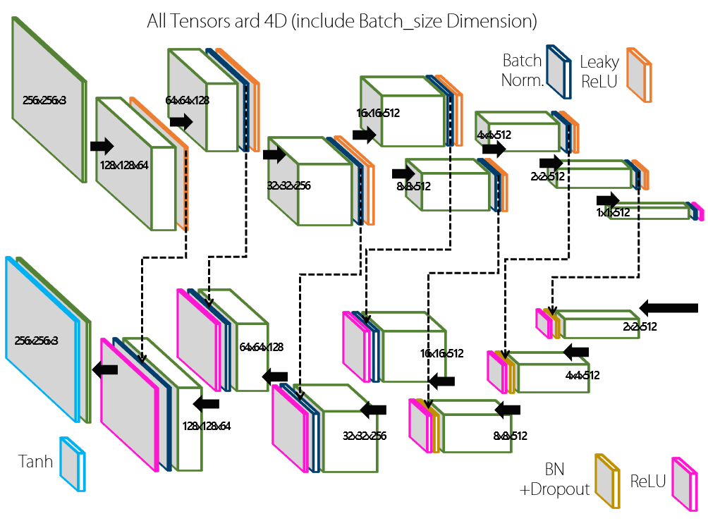</p>

### 3.3 Discriminator Networks (network.py)

<p align="center">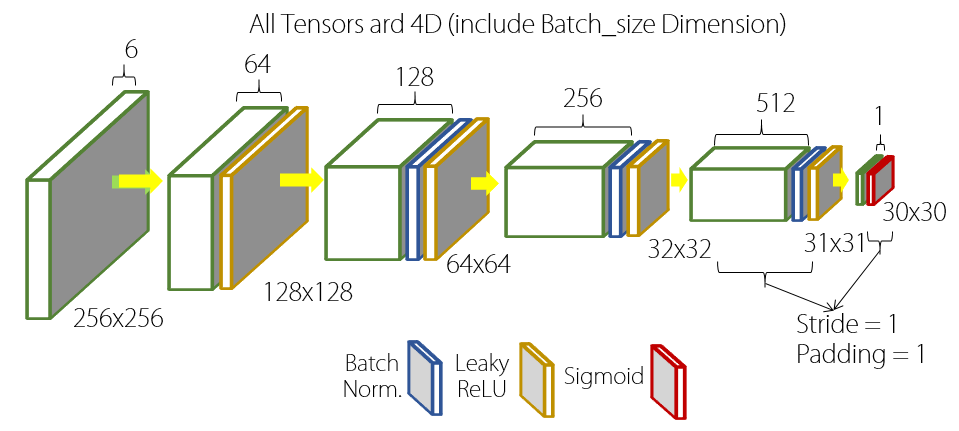</p>

## 4. Database

### 4.1 DB Download

`download-dataset.py` is from [this github link](https://github.com/affinelayer/pix2pix-tensorflow)

- facades: `python database/download-dataset.py facades`
- cityscapes: `python database/download-dataset.py cityscapes`
- maps: `python database/download-dataset.py maps`
- edges2shoes: `python database/download-dataset.py edges2shoes`
- edges2handbags: `python database/download-dataset.py edges2handbags`


### 4.2 DB Setting
- You just have to get a text file that contains all directories of your image data(filelist.txt).
- You can make filelist with following command.

```bash
cd <database_dir>
dir /b /s > filelist.txt
```
- Then you must open 'filelist.txt' and delete line 'your_db_dir/filelist.txt'.


## 5. Train

```bash
python train.py --train filelist.txt
```

- `--train`: Directory of the Text File of Train Filelist 
- `--out_dir`: Directory to Save your Train Result
- `--epochs`: Num of Epochs You Want
- `--batch_size`: Batch Size You Want
- `--direction`: 'AtoB' or 'BtoA'

After finish training, saved models are in the `./output/checkpoint` directory and the Train Results are saved in `./output/result`.(default)

## 6. Test

```bash
python test.py --train filelist.txt
```

- `--test`: Directory of the Text File of Test Filelist
- `--out_dir`: Directory to Save your Train Result
- `--ckpt_dir`: Directory of Trained Model
- `--visnum`: Number of Visualization in an Image File
- `--direction`: 'AtoB' or 'BtoA'


Test results will be saved in `./output_test`(default)


## 7. Results

### [Input | Generated | Ground Truth]

### Edges to Shoes (8 Epochs)
15 Epochs (which is in the Paper) will give better results

<p align="center">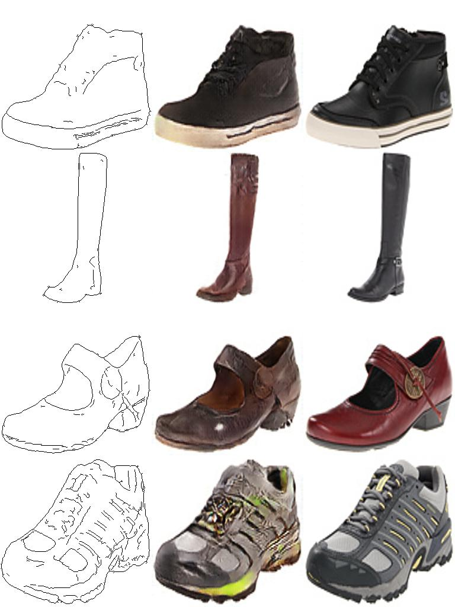</p>
<p align="center">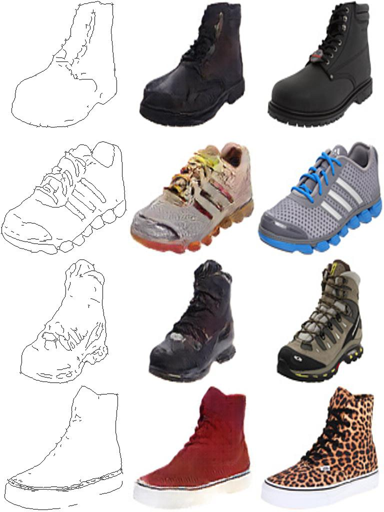</p>


### Maps to Aerials (200 Epochs)

<p align="center">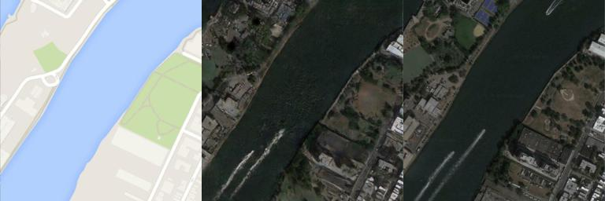</p>
<p align="center">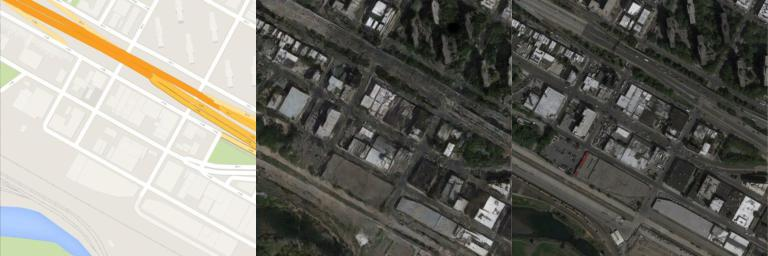</p>
<p align="center">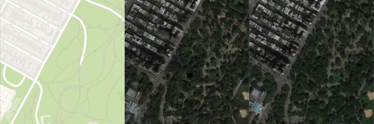</p>
<p align="center">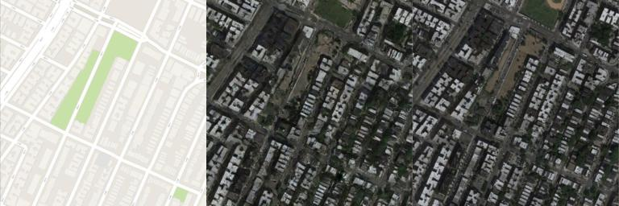</p>
<p align="center">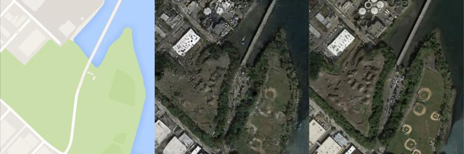</p>
<p align="center">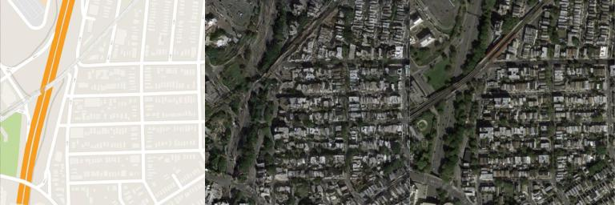</p>
<p align="center">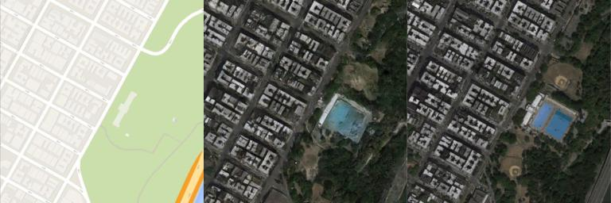</p>
<p align="center">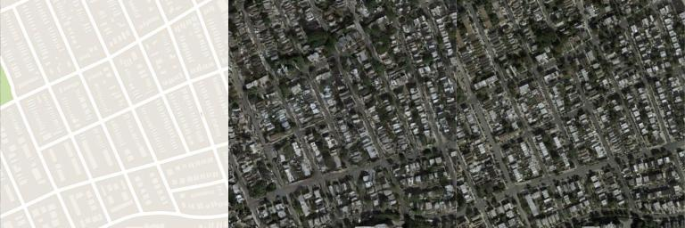</p>

### Architectural labels to Photo (200 Epochs)

<p align="center">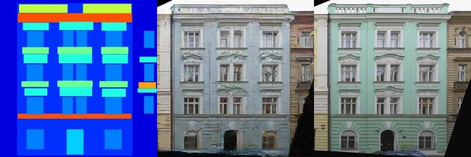</p>
<p align="center">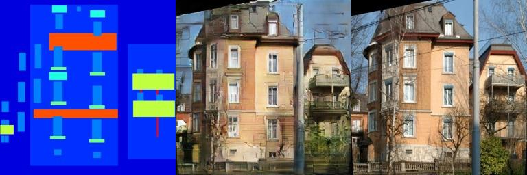</p>
<p align="center">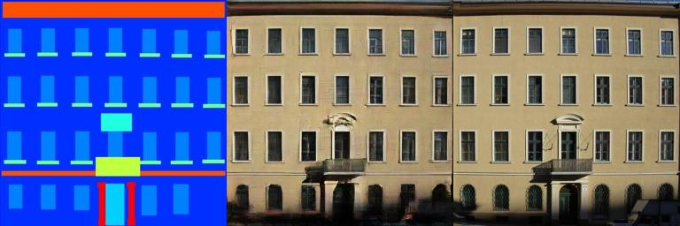</p>
<p align="center"></p>
<p align="center">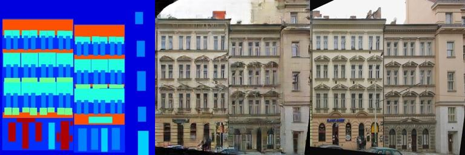</p>
<p align="center">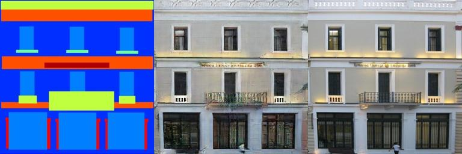</p>
<p align="center">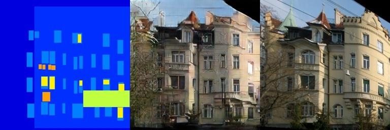</p>
<p align="center">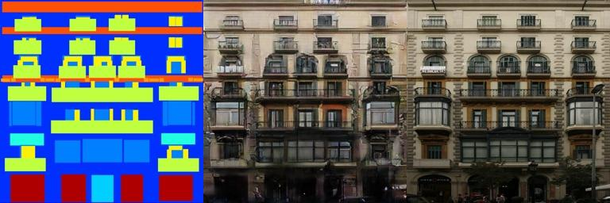</p>


